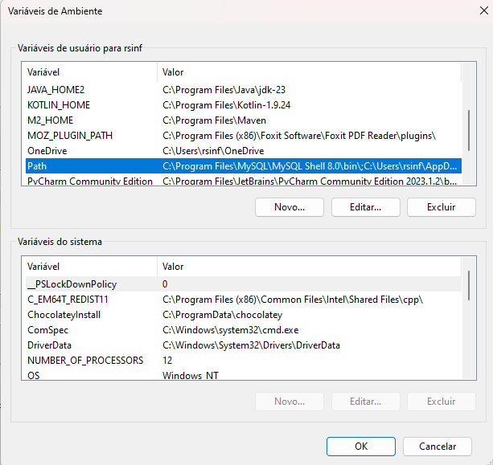
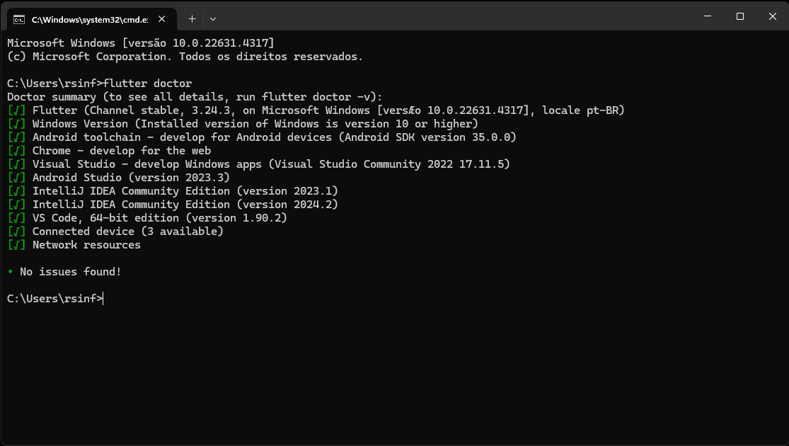
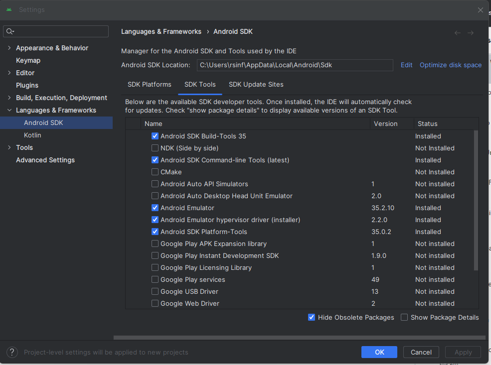

# Configurando ambiente Dart

## Configurando o ambiente para Dart e Flutter

### Instalando a extensão Dart no VSCode:

1. Abra o Visual Studio Code no seu computador.
2. Clique no ícone de extensões no painel lateral esquerdo (parece com um quadrado dentro de outro quadrado) ou pressione `Ctrl + Shift + X`.
3. Na barra de pesquisa, digite **"Dart"** e selecione a extensão chamada **"Dart" feita por "Dart Code"**.
4. Clique no botão "Install" para instalar a extensão Dart.
5. Abra um terminal no Visual Studio Code (`Terminal > New Terminal` ou `Ctrl+\`) e digite `dart --version` para verificar se a instalação foi bem-sucedida.
6. Crie uma pasta para o seu projeto e abra-a no Visual Studio Code (``File > Open Folder``). Dentro dessa pasta, crie um novo arquivo chamado ``main.dart`` e escreva seu código Dart.
7. No terminal do Visual Studio Code, navegue até a pasta do seu projeto e execute ``dart run main.dart`` para ver seu código em ação.

### Instalando a extensão Flutter no VSCode:

1. Abra o Visual Studio Code no seu computador.
2. Clique no ícone de extensões no painel lateral esquerdo (parece com um quadrado dentro de outro quadrado) ou pressione `Ctrl + Shift + X`.
3. Na barra de pesquisa, digite ``"Flutter"`` e clique em ``"Install"`` na extensão Flutter. Isso também instalará a extensão Dart automaticamente.

### Instalando do Chocolatey
O Chocolatey é um gerenciador de pacotes para Windows que facilita a instalação de softwares. Com ele, você pode instalar o Flutter e o Dart com apenas um comando no terminal, economizando tempo e esforço. 
O Chocolatey ajuda a gerenciar dependências de forma eficiente. Ele garante que todas as dependências necessárias para o desenvolvimento com Flutter e Dart estejam instaladas corretamente. 
A documentação oficial do Flutter recomenda o uso do Chocolatey para instalação no Windows, o que significa que você está seguindo práticas recomendadas.

1. Acesse: https://chocolatey.org/install
2. Um pouco mais a abaixo terá uma linha de comando que vc deve copiar.
~~~~
Set-ExecutionPolicy Bypass -Scope Process -Force; [System.Net.ServicePointManager]::SecurityProtocol = [System.Net.ServicePointManager]::SecurityProtocol -bor 3072; iex ((New-Object System.Net.WebClient).DownloadString('https://community.chocolatey.org/install.ps1'))
~~~~
3. 🚨**ATENÇÃO:** Antes de utilizar o comoando acima é necessário fazer a habilitação da execução de script no windows. 
Para isso vc deve entrar no powershell do windows como administrador e executar o comando `Set-ExecutionPolicy Unrestricted` e digite 'S' pra sim.
4. Execute o comando copiado no passo 2.
5. Faça o teste do chocolatey pra ver se está OK através do comando: `choco` ou `choco -?`.

### Instalação do Android Studio

1. **Verificar Requisitos do Sistema** 
Antes de começar, verifique se seu sistema atende aos requisitos mínimos:
- **Sistema Operacional**: Windows 8 ou mais recente (64 bits)
- **Memória RAM**: 8 GB (recomendado 16 GB ou mais)
- **Processador**: Intel Core de segunda geração ou mais recente, ou AMD com suporte ao Hypervisor Framework do Windows
- **Espaço em Disco**: 8 GB (IDE e Android SDK e Emulator)
- **Resolução de Tela**: 1280 x 800 (recomendado 1920 x 1080)

2. **Baixar o Android Studio**
- Acesse o site oficial do Android Studio: [developer.android.com/studio](https://developer.android.com/studio/install)
- Clique no botão "Download Android Studio" para baixar o arquivo .exe.

3. **Executar o Instalador**
- Localize o arquivo baixado e dê um duplo clique para iniciar o instalador.
- Aceite os termos e condições e escolha a opção de instalação padrão, que inclui o Android SDK e o emulador.

4. **Configurar o Android SDK**
- Durante a instalação, escolha a localização do SDK. Evite usar caminhos com espaços ou caracteres especiais.
- Aceite os acordos de licença e aguarde a conclusão da instalação.

5. **Iniciar o Android Studio**
- Após a instalação, inicie o Android Studio.
- Escolha não importar configurações anteriores e selecione a linguagem (Java ou Kotlin).

6. **Configurando o Emulador**
- Após abrir o android studio na primeira tela, no canto superior direito clique nos 3 pontinhos. 
- Selecione a opção **"Virtual Device Manager"**.
- Clique no sinal de **+** no canto superior esquerdo para adicionar um novo Device. 
- Na tela que abriu escolha a categoria e sem seguida escola o tipo de aparelho por exemplo: ``Pixel 6``. Após selecionar clique em Next.
- Agora selecione a versão do Android que vc quer instalar nesse aparelho. **Obs.:** Vc precisa baixar a versão que vc quer usar e para isso basta clicar na seta ou ao selecionar a versão basta apertar a barra de espaço no teclado, ao final do download clique em finish. 
- Após sistema Android selecionado e baixado clique em ``Next``. Caso queira poderá dar um nome para o seu device e em seguida poderá clicar em ``Finish``.
- Após isso aparecerá o device já pronto para uso. Caso queira iniciar o emulador é só clicar no icone no formato de Play. 

7. **Instalando os plugins no Android Studio**
- Após abrir o Android Studio na lateral esqueda, selecione a opção `Plugins`.
- Faça uma busca por Dart e também por Flutter e faça as respectivas instalações.
- Após instalado será necessário reiniciar ao Android Studio. 

### Flutter SDK
1. [Baixe o Flutter SDK](https://flutter.dev/?gad_source=1&gclid=Cj0KCQjwgrO4BhC2ARIsAKQ7zUkFIVIJeQUNIJq_XN3TvGP2CVkcJdBZRkPM7AToIIMgUIfaqd9tYMcaAs3eEALw_wcB&gclsrc=aw.ds): Visite o site oficial do Flutter e baixe o pacote de instalação correspondente ao seu sistema operacional.
2. Clique no botão ``Get Started``.
3. Selecione o sistema operacional desejado, nesse caso vamos instalar no windows. 
4. Como recomendado clique na opção ``Android``.
5. Procure por ``Install the Flutter SDK`` e selecione a aba ``Download and install``.
6. Clique no botão para fazer o download do sdk `flutter_windows_3.24.3-stable.zip`
7. Após finalizado o download, extraia o arquivo que gerará uma pasta com o nome de flutter. Copie esta pasta para o caminho `C:\Users\nome_usuario_local`.
8. Entre na pasta e copie o caminho `C:\Users\nome_usuario_local\flutter\bin`
9. Acesse as variaveis de ambiente atravez do botão iniciar e digitie "variaveis de ambiente".
10. Na tela de variáveis de ambiente seleciona a variavel ``"Path"`` e clique em editar. Cliente no botão novo na janela que vai se abrir e cole o caminho que copiou no passo 8.  

11. Após a configuração das variaveis de ambiente, abra seu CMD e digite o comando `flutter doctor`.

12. Caso ocorra algum erro e não esteja igual a imagem do passo 11, será necessário realizar algumas configurações no Android Studio. 🚨**Obs.:** Se a mensagem de erro for relacionado com o VS Code pode ignorar.
13. Configurando o Adroid Studio para sanar erros do flutter doctor. 
-  Na primeira tela de boas vindas do Android no canto superior direito clique nos 3 pontinhos e selecione a opção de SDK Manager. 
- Selecione a aba SDK Tools.
- Deixe as opções como estão na imagem abaixo. Possivelmente será necessário aguardar o download.

- Após fazer o download reexecute o comando do passo 11.
- 🚨**Atenção**: Caso apresente algum erro relacionado com o Android toolchain siga os seguintes passos: 
    1. Abra o CMD e digite o comando: `flutter doctor --andoid-licenses`
    2. Aceite todas as licensas do android digitando "y" pra yes(Sim).
    3. Execute novamente o comando `Flutter doctor` e com isso deve resolver o problema. 

### Criando um projeto em Flutter

1. Crie um diretório onde vc achar mais conveniente e execute o CMD apartir desse diretório. 
2. Digite o comando `flutter create nome_aplicacao`
3. Se tudo estiver correto deve ser criado um projeto base de flutter onde poderá iniciar com o desenvolvimento. 
