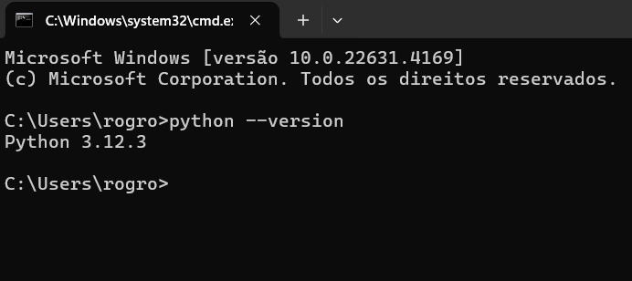

# 	 Configurando o Ambiente de Desenvolvimento Python

↩️ [Retornar para guia](/README.md)

## Instalação do Python
Primeiro, vamos instalar o Python em seu computador. A seguir, detalho os passos para diferentes sistemas operacionais:

### No Windows:
1. Acesse o site oficial do Python: [Python.org](https://www.python.org/downloads/).
2. Clique em **“Downloads”** e selecione a versão mais recente do Python (normalmente, a série 3.x.x).
3. Execute o instalador baixado.
4. Marque a opção “Add Python to PATH” durante a instalação.
5. Clique em “Install Now”.
6. Para verificar se a instalação foi bem-sucedida, abra o Prompt de Comando (CMD) e digite o seguinte comando:

~~~ 
python --version 
~~~

Você verá a versão do Python instalada.

### No macOS:
1. Acesse o site oficial do Python: Python.org.
2. Clique em “Downloads” e escolha a versão mais recente do Python para macOS.
3. Execute o arquivo .pkg baixado e siga as instruções na tela.
4. Para verificar a instalação, abra o Terminal e digite:

~~~~
python3 --version
~~~~

### No Linux:
1. Use o gerenciador de pacotes do seu sistema para instalar o Python. Por exemplo, no Ubuntu/Debian, abra o Terminal e digite:

~~~
sudo apt-get update
sudo apt-get install python3
~~~

2. Para verificar a instalação, digite:

~~~~
python3 --version
~~~~

## Escolha de uma IDE ou Editor de Texto
Agora que o Python está instalado, escolha uma IDE (Integrated Development Environment) ou um editor de texto para escrever seu código. Algumas opções populares são:

1. Visual Studio Code (VSCode): Um editor leve e poderoso com suporte a Python.
- [Download VSCode](https://code.visualstudio.com/download) 
- [Configurando o VSCode para utilizar Python - Video](https://www.youtube.com/watch?v=BSjdcLzgfIw&ab_channel=DevAprender%7CJhonatandeSouza)

2. PyCharm: Uma IDE completa para desenvolvimento Python.
IDLE: O próprio IDLE que vem com o Python.
- [Download PyCharm](https://www.jetbrains.com/pycharm/download/?section=windows)
- [Configurando o pycharm - Video](https://www.youtube.com/watch?v=i-5nYErMVsk&ab_channel=HashtagPrograma%C3%A7%C3%A3o)

## Configuração do Ambiente Virtual (Opcional, mas recomendado)
Para isolar projetos e suas dependências, é uma boa prática criar ambientes virtuais. Use o venv (ou virtualenv) para isso:

1. Navegue até a pasta do seu projeto no terminal.
2. Crie um novo ambiente virtual:
~~~~
python -m venv nome_do_ambiente
~~~~
3. Ative o ambiente virtual:

**No Windows:**
~~~~
nome_do_ambiente\Scripts\activate
~~~~

**No macOS/Linux:**
~~~~
source nome_do_ambiente/bin/activate
~~~~

## Comece a Programar!
Agora você está pronto para escrever seu primeiro código Python. Abra sua IDE ou editor de texto, crie um novo arquivo .py e comece a explorar o mundo da programação!